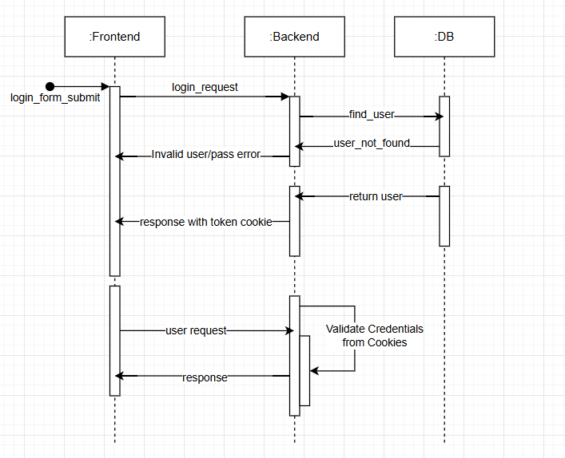

# Documentacion

## Tecnologías y Herramientas Utilizadas

### Frontend
- **React**: Una biblioteca de JavaScript para construir interfaces de usuario.
- **Vite**: Un entorno de desarrollo rápido para proyectos de frontend, que proporciona una configuración mínima y una recarga en caliente rápida.

### Backend
- **Fastify**: Un framework web rápido y de bajo consumo para Node.js, diseñado para ofrecer el mejor rendimiento posible.
- **MikroORM**: Un ORM (Object-Relational Mapper) para TypeScript y JavaScript, que soporta múltiples bases de datos, incluyendo PostgreSQL.
- **PostgreSQL**: Un sistema de gestión de bases de datos relacional y orientado a objetos, conocido por su robustez y rendimiento.

## Conceptos Clave

### Cookies HTTP/HTTPS
Las cookies son pequeños fragmentos de datos que un servidor envía al navegador del usuario. El navegador puede almacenar estas cookies y enviarlas de vuelta al servidor con cada solicitud subsecuente. Las cookies se utilizan para gestionar sesiones, almacenar preferencias del usuario y realizar un seguimiento de la actividad del usuario.

### Algoritmo AES
AES (Advanced Encryption Standard) es un algoritmo de cifrado simétrico ampliamente utilizado en todo el mundo. AES cifra y descifra datos en bloques de 128 bits utilizando claves de 128, 192 o 256 bits. Es conocido por su seguridad y eficiencia.

### JSON Web Tokens (JWT)
JWT es un estándar abierto para crear tokens de acceso que permiten la transmisión segura de información entre partes como un objeto JSON. Estos tokens son firmados digitalmente, lo que garantiza su integridad y autenticidad. Se utilizan comúnmente para la autenticación y autorización en aplicaciones web.



### Como Ejecutar
Primero instalar los paquetes necesarios usando ```npm install``` en el cliente como el servidor.

Levantar un servidor de base de datos con postgreSQL y colocar la configuracion de host, user y password en un archivo .env en la raiz del proyecto (ejemplo incluido)

Ejecutar ```npm run dev``` en el cliente y ```npm run dev``` en el server

