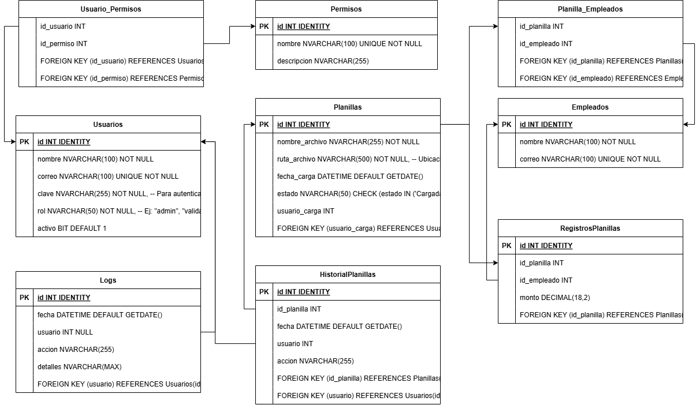

# Practica 3

Esta practica abareca el diseño de una migracion desde una aplicacion monolitica a una de microservicios

## Arquitectura Original

## Nueva Arquitectura de Microservicios

## Diseño de Microservicios

### MS: Autenticacion (JWT)
Este microservicio se encargara de administrar los permisos y accesos granulados de la aplicacion para los usuarios autenticados, generar un token que contendra los roles correspondientes a cada usuario que seran necesarios para interactuar con los otros y sus funciones especificas.
Tendra funciones como:
- Login: Validara las credenciales y devolvera un token de acceso en las cookies.
- Logout: Eliminara tokens de acceso e invalidara cualquier cookie almacenada y su token.
- Refresh: Renovara el token de acceso.
- Validar: Valida la autenticidad de un token de acceso.

### MS: Planillas
Este microservicio se encargara exclusivamente de administrar las planillas y todo lo relacionado a ellas como cargarlas, validarlas y almacenarlas.
Tendra funciones como:
- Cargar Planilla: Permitira cargar una planilla en formato CSV
- Validar Planilla: Validara una planilla cargada segun las normas internas.
- Aprobar Planilla: Agregara una aprobacion a una planilla (hasta un total de 3 aprobaciones)
- Enviar planillas: Una vez aprobada, una planilla puede ser enviada para ser procesada por la entidad financiera (servicio externo).
- Historial: Devolvera todas las planillas que se han cargado y estan almacenadas
- Subhistorial: Devolvera el historial de una planilla

### MS: Notificaciones
Este microservicio se encargara exclusivamente de enviar notificaciones a los usuario tanto internos como externos al area de administracion de planillas.
Tendra funciones como:
- Enviar Notificacion Individual
- Enviar Notificacion Masiva
- Enviar Codigo de Seguridad
- Enviar Correo de Reinicio Contraseña
- Enviar Correo de Bienvenida

### MS: Log
Este microservicio se encargara exclusivamente de registrar todas las acciones que se realizan dentro del sistema, como el inicio de sesion, carga de planillas, aprobacion, y envio de notificaciones.
Tendra funciones como:
- Crear Log: Crea un nuevoi registro con datos relevantes de la accion realizada y el usuario.
- Consultar Logs: Devuelve informacion de los registros aplicando filtros y ordenamiento relevante.

### Otros Servicios
Autenticacion:
- Principal: Usando los servicios de AWS se implementara la autenticacion oAuth que servira para el inicio de sesion simple usando el servicio Cognito de AWS que se conectara con el servidor de autenticacion de la empresa como Active Directory.

## Diagrama Entidad Relacion
