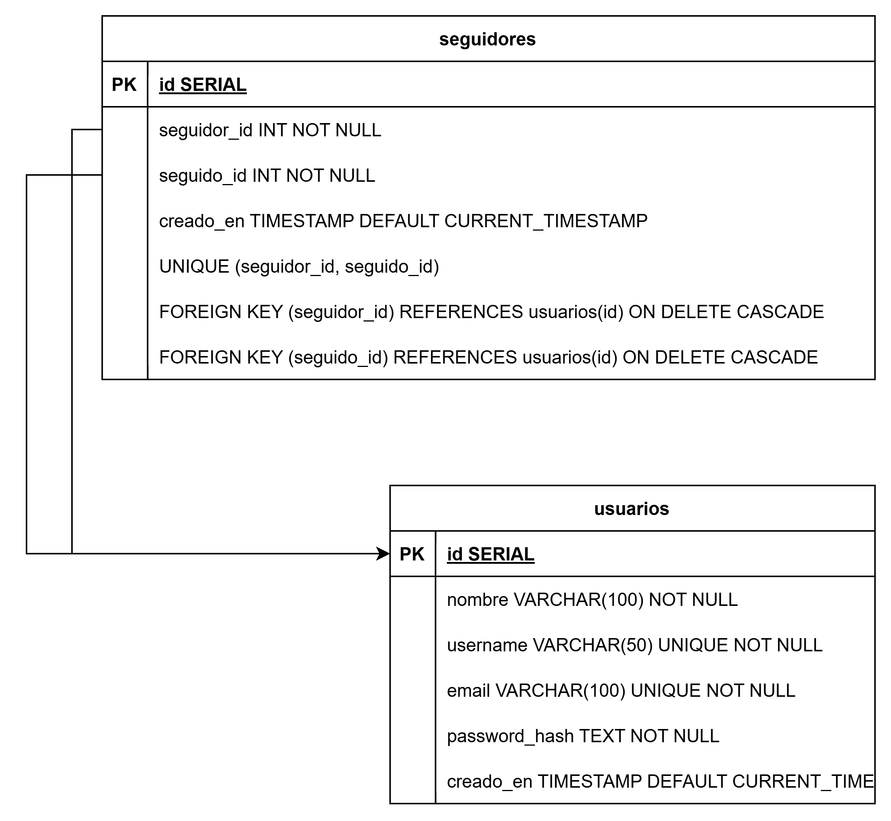
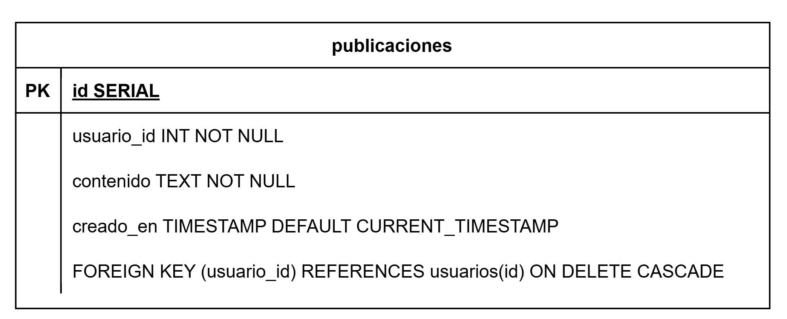
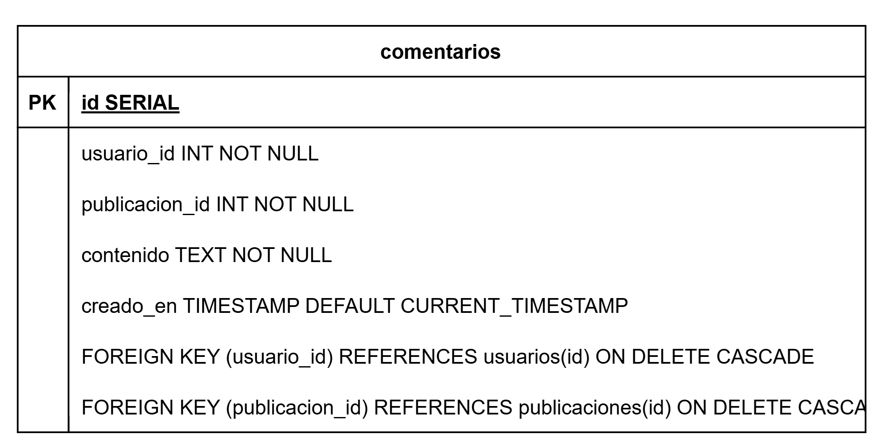
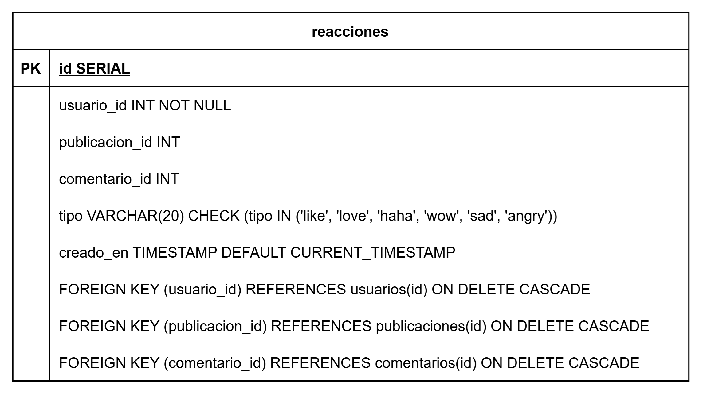

# 📌 Mini Red Social (Tipo Twitter) - Microservicios

## 📝 Descripción  
Este proyecto es una mini red social inspirada en Twitter, donde los usuarios pueden registrarse, publicar mensajes cortos, comentar publicaciones, reaccionar y seguir a otros usuarios.  

El sistema está basado en una **arquitectura de microservicios**, con **dos servicios REST** y **dos servicios GraphQL**, cada uno encargado de una parte específica del sistema.

---

## Arquitectura de Microservicios  

1️⃣ **Usuarios (GRAPHQL - Node.js + Apollo Server)**  
   - Registro e inicio de sesión.  
   - Obtención de perfiles de usuarios.  
   - Gestión de seguidores.  

2️⃣ **Publicaciones (GRAPHQL - Node.js + Apollo Server)**  
   - Creación, edición y eliminación de publicaciones.  
   - Obtención del feed de publicaciones.  

3️⃣ **Comentarios (REST - Golang + Fiber)**  
   - Creación y obtención de comentarios en publicaciones.  

4️⃣ **Reacciones (REST - Golang + Fiber)**  
   - Gestión de reacciones (likes, etc.) en publicaciones y comentarios.  

---

## 🔗 Comunicación entre Servicios  
- Cada microservicio tiene su propia base de datos. 
- Se usa **JWT** para autenticación entre servicios.
- El API Gateway (NGINX o Express) maneja el enrutamiento.
- [Ver contrato de Microservicios](https://documenter.getpostman.com/view/8972225/2sAYk8uNRV).

### GraphQL: Usuarios

#### Diagrama Entidad Relacion


#### Dockerfile
 ```docker
 # Stage 1:Build
FROM node:22.14.0-alpine
WORKDIR /app
COPY . .
RUN npm i
RUN npm run compile

# Stage 2:Container
FROM node:22.14.0-alpine

WORKDIR /app
COPY --from=0 /app/dist ./dist
COPY ./package.json /app/package.json
RUN npm i

EXPOSE 3000
ENV DB_HOST=localhost
ENV DB_USER=postgres
ENV DB_PASS=postgres123
ENV DB_NAME=p4
ENV DB_PORT=5432

CMD ["node", "dist/index.js"]
 ```

 ### GraphQL: Publicaciones
 #### Entidad Relacion
 

 #### Dockerfile
 ```docker
 # Stage 1:Build
FROM node:22.14.0-alpine
WORKDIR /app
COPY . .
RUN npm i
RUN npm run compile

# Stage 2:Container
FROM node:22.14.0-alpine

WORKDIR /app
COPY --from=0 /app/dist ./dist
COPY ./package.json /app/package.json
RUN npm i

EXPOSE 3000
ENV DB_HOST=localhost
ENV DB_USER=postgres
ENV DB_PASS=postgres123
ENV DB_NAME=p4
ENV DB_PORT=5432

CMD ["node", "dist/index.js"]
 ```

 ### REST: Comentarios

 #### Entidad Relacion
 
 
 #### Dockerfile
 ```dockerfile
 # syntax=docker/dockerfile:1
# Etapa 1: Construcción del binario
FROM golang:1.24.1-alpine

# Establecer el directorio de trabajo dentro del contenedor
WORKDIR /app

# Copiar los archivos go.mod y go.sum
COPY go.mod go.sum ./

# Descargar las dependencias del proyecto
RUN go mod tidy

# Copiar el código fuente al contenedor
COPY . .

# Construir el binario
RUN go build -o main .

# Etapa 2: Crear la imagen final
FROM alpine:latest

# Instalar dependencias necesarias para ejecutar el binario
RUN apk --no-cache add ca-certificates

# Establecer el directorio de trabajo
WORKDIR /root/

# Copiar el binario desde la etapa de construcción
COPY --from=0 /app/main .

# Exponer el puerto que usará la API
EXPOSE 3000
ENV DB_HOST=localhost
ENV DB_USER=postgres
ENV DB_PASS=postgres123
ENV DB_DBNAME=p4
ENV DB_PORT=5432

# Comando para ejecutar el binario cuando se inicie el contenedor
CMD ["./main"]
 ```

 ### REST: Reacciones

 #### Entidad Relacion
 

 #### Dockerfile
 ```dockerfile
 # syntax=docker/dockerfile:1
# Etapa 1: Construcción del binario
FROM golang:1.24.1-alpine

# Establecer el directorio de trabajo dentro del contenedor
WORKDIR /app

# Copiar los archivos go.mod y go.sum
COPY go.mod go.sum ./

# Descargar las dependencias del proyecto
RUN go mod tidy

# Copiar el código fuente al contenedor
COPY . .

# Construir el binario
RUN go build -o main .

# Etapa 2: Crear la imagen final
FROM alpine:latest

# Instalar dependencias necesarias para ejecutar el binario
RUN apk --no-cache add ca-certificates

# Establecer el directorio de trabajo
WORKDIR /root/

# Copiar el binario desde la etapa de construcción
COPY --from=0 /app/main .

# Exponer el puerto que usará la API
EXPOSE 3000
ENV DB_HOST=localhost
ENV DB_USER=postgres
ENV DB_PASS=postgres123
ENV DB_DBNAME=p4
ENV DB_PORT=5432

# Comando para ejecutar el binario cuando se inicie el contenedor
CMD ["./main"]
 ```

 ### Docker Compose
 ```dockerfile
 services:
  db_auth:
    container_name: database_auth
    image: postgres:latest
    volumes:
      - ./db_data_auth:/var/lib/postgresql
    restart: always
    healthcheck:
      test: ["CMD-SHELL", "pg_isready", "-d", "p4"]
      interval: 3s
      timeout: 10s
      retries: 15
      start_period: 10s
    environment:
      - POSTGRES_USER=postgres
      - POSTGRES_PASSWORD=postgres123
      - POSTGRES_DB=p4
    networks:
      - p4_network
  db_posts:
    container_name: database_posts
    image: postgres:latest
    volumes:
      - ./db_data_posts:/var/lib/postgresql
    restart: always
    healthcheck:
      test: ["CMD-SHELL", "pg_isready", "-d", "p4"]
      interval: 3s
      timeout: 10s
      retries: 15
      start_period: 10s
    environment:
      - POSTGRES_USER=postgres
      - POSTGRES_PASSWORD=postgres123
      - POSTGRES_DB=p4
    networks:
      - p4_network
  db_comms:
    container_name: db_comms
    image: postgres:latest
    restart: always
    healthcheck:
      test: ["CMD-SHELL", "pg_isready", "-d", "p4"]
      interval: 3s
      timeout: 10s
      retries: 15
      start_period: 10s
    volumes:
      - ./db_data_comms:/var/lib/postgresql
    networks:
      - p4_network
    environment:
      - POSTGRES_USER=postgres
      - POSTGRES_PASSWORD=postgres123
      - POSTGRES_DB=p4
      - PGUSER=postgres
  db_reacts:
    container_name: db_reacts
    image: postgres:latest
    restart: always
    healthcheck:
      test: ["CMD-SHELL", "pg_isready", "-d", "p4"]
      interval: 3s
      timeout: 10s
      retries: 15
      start_period: 15s
    volumes:
      - ./db_data_reacts:/var/lib/postgresql
    ports:
      - "5435:5432"
    environment:
      - POSTGRES_USER=postgres
      - POSTGRES_PASSWORD=postgres123
      - POSTGRES_DB=p4
      - PGUSER=postgres
    networks:
      - p4_network
  api_comments:
    container_name: api_comments
    build: ./MSComentarios
    depends_on:
      db_comms:
        condition: service_healthy
    environment:
      - DB_HOST=db_comms
      - DB_USER=postgres
      - DB_PASS=postgres123
      - DB_PORT=5432
      - DB_NAME=p4
    networks:
      - p4_network
  api_auth:
    container_name: api_auth
    build: ./MSAuth
    depends_on:
      db_auth:
        condition: service_healthy
    environment:
      - DB_HOST=db_auth
      - DB_USER=postgres
      - DB_PASS=postgres123
      - DB_PORT=5432
      - DB_NAME=p4
    networks:
      - p4_network
  api_reacts:
    container_name: api_reacts
    build: ./MSReacciones
    depends_on:
      db_reacts:
        condition: service_healthy
    environment:
      - DB_HOST=db_reacts
      - DB_USER=postgres
      - DB_PASS=postgres123
      - DB_PORT=5432
      - DB_NAME=p4
    networks:
      - p4_network
  api_posts:
    container_name: api_posts
    build: ./MSPublicaciones
    depends_on:
      db_posts:
        condition: service_healthy
    environment:
      - DB_HOST=db_posts
      - DB_USER=postgres
      - DB_PASS=postgres123
      - DB_PORT=5432
      - DB_NAME=p4
    networks:
      - p4_network
  api_gateway:
    container_name: api_gateway
    image: nginx
    depends_on:
      api_posts:
        condition: service_started
      api_auth:
        condition: service_started
      api_reacts:
        condition: service_started
      api_comments:
        condition: service_started
    ports:
      - "3000:80"
    volumes:
      - ./nginx.conf:/etc/nginx/nginx.conf:rw
    networks:
      - p4_network
networks:
  p4_network:
    driver: bridge
 ```

 ## Diagrama de Arquitectura
