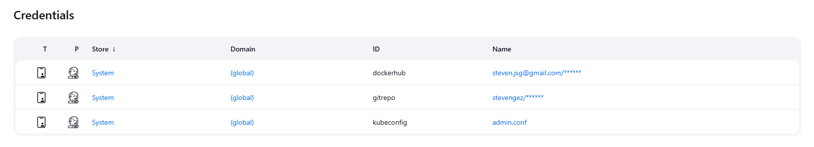

## Documentacion
La siguiente documentacion describe la forma de desplegar de manera automatica un cluster de kubernetes en Google Cloud Platform usando kubespray, y usando Jenkins, realizar CI/CD

## YAML de Microservicios

### ms_reacts_deploy.yaml
```yaml
apiVersion: apps/v1
kind: StatefulSet
metadata:
  name: db-reacts-stateful
spec:
  serviceName: "postgres"  # Nombre del servicio que maneja los pods de PostgreSQL
  replicas: 1  # Número de réplicas
  selector:
    matchLabels:
      app: db_reacts
  template:
    metadata:
      labels:
        app: db_reacts
    spec:
      containers:
      - name: postgres
        image: postgres:latest  # Imagen de PostgreSQL
        env:
        - name: POSTGRES_USER
          value: "postgres"
        - name: POSTGRES_PASSWORD
          value: "postgres123"
        - name: POSTGRES_DB
          value: "p4"
        - name: PGUSER
          value: "postgres"
        - name: PGDATA
          value: "/var/lib/postgresql/data/pgdata"
        volumeMounts:
        - name: postgres-data-reacts
          mountPath: /var/lib/postgresql/data  # Ruta donde PostgreSQL almacenará los datos
  volumeClaimTemplates:
  - metadata:
      name: postgres-data-reacts
    spec:
      accessModes: ["ReadWriteOnce"]
      resources:
        requests:
          storage: 1Gi # Tamaño del volumen persistente
---
apiVersion: v1
kind: Service
metadata:
  name: db-reacts-svc
spec:
  ports:
    - port: 5432
  clusterIP: None  # Esto es clave para los StatefulSets
  selector:
    app: db_reacts
---
apiVersion: apps/v1
kind: Deployment
metadata:
  name: reacts-api-deployment
  labels:
    app: api-reacts
spec:
  replicas: 1
  selector:
    matchLabels:
      app: api-reacts
  template:
    metadata:
      labels:
        app: api-reacts
    spec:
      containers:
      - name: api-reacts
        image: stevengez/sap5-reacts:latest
        imagePullPolicy: Always
        resources:
          requests:
            memory: "128Mi"
            cpu: "80m"
          limits:
            memory: "128Mi"
            cpu: "300m"
        ports:
        - containerPort: 3000
        env:
        - name: DB_HOST
          value: "db-reacts-svc"
        - name: DB_PORT
          value: "5432"
        - name: DB_USER
          value: "postgres"
        - name: DB_PASSWORD
          value: "postgres123"
        - name: DB_NAME
          value: "p4"
---
apiVersion: v1
kind: Service
metadata:
  name: api-reacts-svc
spec:
  selector:
    app: api-reacts
  ports:
  - protocol: TCP
    port: 80
    targetPort: 3000
---
apiVersion: autoscaling/v2
kind: HorizontalPodAutoscaler
metadata:
  name: reacts-api-hpa
spec:
  scaleTargetRef:
    apiVersion: apps/v1
    kind: Deployment
    name: reacts-api-deployment
  minReplicas: 1
  maxReplicas: 2
  metrics:
  - type: Resource
    resource:
      name: cpu
      target:
        type: Utilization
        averageUtilization: 80
```

### ms_posts_deploy.yaml
```yaml
apiVersion: apps/v1
kind: StatefulSet
metadata:
  name: db-posts-stateful
spec:
  serviceName: "postgres"  # Nombre del servicio que maneja los pods de PostgreSQL
  replicas: 1  # Número de réplicas
  selector:
    matchLabels:
      app: db_posts
  template:
    metadata:
      labels:
        app: db_posts
    spec:
      containers:
      - name: postgres
        image: postgres:latest  # Imagen de PostgreSQL
        env:
        - name: POSTGRES_USER
          value: "postgres"
        - name: POSTGRES_PASSWORD
          value: "postgres123"
        - name: POSTGRES_DB
          value: "p5"
        - name: PGUSER
          value: "postgres"
        - name: PGDATA
          value: "/var/lib/postgresql/data/pgdata"
        volumeMounts:
        - name: postgres-data-posts
          mountPath: /var/lib/postgresql/data  # Ruta donde PostgreSQL almacenará los datos
  volumeClaimTemplates:
  - metadata:
      name: postgres-data-posts
    spec:
      accessModes: ["ReadWriteOnce"]
      resources:
        requests:
          storage: 1Gi # Tamaño del volumen persistente
---
apiVersion: v1
kind: Service
metadata:
  name: db-posts-svc
spec:
  ports:
    - port: 5432
  clusterIP: None  # Esto es clave para los StatefulSets
  selector:
    app: db_posts
---
apiVersion: apps/v1
kind: Deployment
metadata:
  name: posts-api-deployment
  labels:
    app: api-posts
spec:
  replicas: 1
  selector:
    matchLabels:
      app: api-posts
  template:
    metadata:
      labels:
        app: api-posts
    spec:
      containers:
      - name: api-posts
        image: stevengez/sap5-posts:latest
        imagePullPolicy: Always
        resources:
          requests:
            memory: "128Mi"
            cpu: "80m"
          limits:
            memory: "180Mi"
            cpu: "350m"
        ports:
        - containerPort: 3000
        env:
        - name: DB_HOST
          value: "db-posts-svc"
        - name: DB_PORT
          value: "5432"
        - name: DB_USER
          value: "postgres"
        - name: DB_PASSWORD
          value: "postgres123"
        - name: DB_NAME
          value: "p5"
---
apiVersion: v1
kind: Service
metadata:
  name: api-posts-svc
spec:
  selector:
    app: api-posts
  ports:
  - protocol: TCP
    port: 80
    targetPort: 3000
---
apiVersion: autoscaling/v2
kind: HorizontalPodAutoscaler
metadata:
  name: posts-api-hpa
spec:
  scaleTargetRef:
    apiVersion: apps/v1
    kind: Deployment
    name: posts-api-deployment
  minReplicas: 1
  maxReplicas: 2
  metrics:
  - type: Resource
    resource:
      name: cpu
      target:
        type: Utilization
        averageUtilization: 80
```

### ms_comms_deploy.yaml
```yaml
apiVersion: apps/v1
kind: StatefulSet
metadata:
  name: db-comms-stateful
spec:
  serviceName: "postgres"  # Nombre del servicio que maneja los pods de PostgreSQL
  replicas: 1  # Número de réplicas
  selector:
    matchLabels:
      app: db_comms
  template:
    metadata:
      labels:
        app: db_comms
    spec:
      containers:
      - name: postgres
        image: postgres:latest  # Imagen de PostgreSQL
        env:
        - name: POSTGRES_USER
          value: "postgres"
        - name: POSTGRES_PASSWORD
          value: "postgres123"
        - name: POSTGRES_DB
          value: "p4"
        - name: PGUSER
          value: "postgres"
        - name: PGDATA
          value: "/var/lib/postgresql/data/pgdata"
        volumeMounts:
        - name: postgres-data-comms
          mountPath: /var/lib/postgresql/data  # Ruta donde PostgreSQL almacenará los datos
  volumeClaimTemplates:
  - metadata:
      name: postgres-data-comms
    spec:
      accessModes: ["ReadWriteOnce"]
      resources:
        requests:
          storage: 1Gi # Tamaño del volumen persistente
---
apiVersion: v1
kind: Service
metadata:
  name: db-comms-svc
spec:
  ports:
    - port: 5432
  clusterIP: None  # Esto es clave para los StatefulSets
  selector:
    app: db_comms
---
apiVersion: apps/v1
kind: Deployment
metadata:
  name: comms-api-deployment
  labels:
    app: api-comms
spec:
  replicas: 1
  selector:
    matchLabels:
      app: api-comms
  template:
    metadata:
      labels:
        app: api-comms
    spec:
      containers:
      - name: api-comms
        image: stevengez/sap5-comms:latest
        imagePullPolicy: Always
        resources:
          requests:
            memory: "128Mi"
            cpu: "80m"
          limits:
            memory: "128Mi"
            cpu: "300m"
        ports:
        - containerPort: 3000
        env:
        - name: DB_HOST
          value: "db-comms-svc"
        - name: DB_PORT
          value: "5432"
        - name: DB_USER
          value: "postgres"
        - name: DB_PASSWORD
          value: "postgres123"
        - name: DB_NAME
          value: "p4"
---
apiVersion: v1
kind: Service
metadata:
  name: api-comms-svc
spec:
  selector:
    app: api-comms
  ports:
  - protocol: TCP
    port: 80
    targetPort: 3000
---
apiVersion: autoscaling/v2
kind: HorizontalPodAutoscaler
metadata:
  name: comms-api-hpa
spec:
  scaleTargetRef:
    apiVersion: apps/v1
    kind: Deployment
    name: comms-api-deployment
  minReplicas: 1
  maxReplicas: 2
  metrics:
  - type: Resource
    resource:
      name: cpu
      target:
        type: Utilization
        averageUtilization: 80
```

### ms_auth_deploy.yaml
```yaml
apiVersion: apps/v1
kind: StatefulSet
metadata:
  name: db-auth-stateful
spec:
  serviceName: "postgres"  # Nombre del servicio que maneja los pods de PostgreSQL
  replicas: 1  # Número de réplicas
  selector:
    matchLabels:
      app: db_auth
  template:
    metadata:
      labels:
        app: db_auth
    spec:
      containers:
      - name: postgres
        image: postgres:latest  # Imagen de PostgreSQL
        env:
        - name: POSTGRES_USER
          value: "postgres"
        - name: POSTGRES_PASSWORD
          value: "postgres123"
        - name: POSTGRES_DB
          value: "p5"
        - name: PGUSER
          value: "postgres"
        - name: PGDATA
          value: "/var/lib/postgresql/data/pgdata"  # Ruta donde PostgreSQL almacenará los datos
        volumeMounts:
        - name: postgres-data-auth
          mountPath: /var/lib/postgresql/data  # Ruta donde PostgreSQL almacenará los datos
  volumeClaimTemplates:
  - metadata:
      name: postgres-data-auth
    spec:
      accessModes: ["ReadWriteOnce"]
      resources:
        requests:
          storage: 1Gi # Tamaño del volumen persistente
---
apiVersion: v1
kind: Service
metadata:
  name: db-auth-svc
spec:
  ports:
    - port: 5432
  clusterIP: None  # Esto es clave para los StatefulSets
  selector:
    app: db_auth
---
apiVersion: apps/v1
kind: Deployment
metadata:
  name: auth-api-deployment
  labels:
    app: api-auth
spec:
  replicas: 1
  selector:
    matchLabels:
      app: api-auth
  template:
    metadata:
      labels:
        app: api-auth
    spec:
      containers:
      - name: api-auth
        image: stevengez/sap5-msauth:p6-v1
        imagePullPolicy: Always
        resources:
          requests:
            memory: "128Mi"
            cpu: "80m"
          limits:
            memory: "180Mi"
            cpu: "350m"
        ports:
        - containerPort: 3000
        env:
        - name: DB_HOST
          value: "db-auth-svc"
        - name: DB_PORT
          value: "5432"
        - name: DB_USER
          value: "postgres"
        - name: DB_PASSWORD
          value: "postgres123"
        - name: DB_NAME
          value: "p5"
---
apiVersion: v1
kind: Service
metadata:
  name: api-auth-svc
spec:
  selector:
    app: api-auth
  ports:
  - protocol: TCP
    port: 80
    targetPort: 3000
---
apiVersion: autoscaling/v2
kind: HorizontalPodAutoscaler
metadata:
  name: auth-api-hpa
spec:
  scaleTargetRef:
    apiVersion: apps/v1
    kind: Deployment
    name: auth-api-deployment
  minReplicas: 1
  maxReplicas: 2
  metrics:
  - type: Resource
    resource:
      name: cpu
      target:
        type: Utilization
        averageUtilization: 80
```

## Preparar VMs en GCP

Se crea la red y subred
```bash
gcloud compute networks create kubep7 --subnet-mode custom
gcloud compute networks subnets create kubernetes \
  --network kubep7 \
  --range 10.240.0.0/24
```
Se agregan las reglas al firewall
```bash
gcloud compute firewall-rules create kubep7-allow-internal \
  --allow tcp,udp,icmp,vxlan \
  --network kubernetes-the-kubespray-way \
  --source-ranges 10.240.0.0/24

gcloud compute firewall-rules create kubep7-allow-external \
  --allow tcp:80,tcp:6443,tcp:443,tcp:22,tcp:30000,tcp:30001,icmp \
  --network kubernetes-the-kubespray-way \
  --source-ranges 0.0.0.0/0
```

Se crean los instance template para el controller
```bash
gcloud compute instance-templates create kubep7-controller-template \
    --boot-disk-size 100GB \
    --can-ip-forward \
    --image-family ubuntu-2204-lts \
    --image-project ubuntu-os-cloud \
    --machine-type e2-medium \
    --provisioning-model=SPOT \
    --scopes compute-rw,storage-ro,service-management,service-control,logging-write,monitoring \
    --subnet kubernetes \
    --tags kubep7,controller

```
Y se crea uno para los nodos
```
gcloud compute instance-templates create kubep7-worker-template \
    --boot-disk-size 100GB \
    --can-ip-forward \
    --image-family ubuntu-2204-lts \
    --image-project ubuntu-os-cloud \
    --machine-type e2-medium \
    --provisioning-model=SPOT \
    --scopes compute-rw,storage-ro,service-management,service-control,logging-write,monitoring \
    --subnet kubernetes \
    --tags kubep7,worker
```

## Preparar Kubespray
Clonar el repositorio de kubespray
```bash
git clone gh repo clone kubespray/kubespray
```
Modificar el archivo de inventory.ini con las IPs de las VM en gcp
```bash
[kube_control_plane]
node1 ansible_host=34.60.73.223

[etcd:children]
kube_control_plane

[kube_node]
node4 ansible_host=34.67.203.3
node5 ansible_host=34.72.38.87
node6 ansible_host=34.59.70.126
```

Se habilita el uso de almacenamienmto local modificando addons.yaml
```yaml
# Rancher Local Path Provisioner
local_path_provisioner_enabled: true
local_path_provisioner_namespace: "local-path-storage"
local_path_provisioner_storage_class: "local-path"
local_path_provisioner_reclaim_policy: Delete
local_path_provisioner_claim_root: /opt/local-path-provisioner/
local_path_provisioner_debug: false
```

Se instalan las dependencias con pip y se cambia el python context a un nuevo entorno virtual
```bash
pip install -r requirements.txt
python -m venv venv
source venv/bin/activate
```

Ejecutar al comando para inicializar el cluster de kubernetes
```bash
ansible-playbook -i inventory/mycluster/inventory.ini -u stevengez -b -v --private-key=~/.ssh/google_compute_engine cluster.yml
```
Este comando puede tomar hasta 20min

## CI/CD Contenedores
Crear un contenedor para ejecutar Docker in Docker y la instancia de Jenkins para CI/CD

```bash
docker run -d `
	--name dind `
	--privileged `
	--network p7 `
	-p 2375:2375 `
	-e DOCKER_TLS_CERTDIR="" `
	docker:dind
```

```bash
docker run -d `
  --name jenkins `
  --privileged `
  --network p7 `
  -p 8080:8080 -p 50000:50000 `
  -v jenkins_home:/var/jenkins_home `
  jenkins/jenkins:lts
```

```bash
docker exec -it -u 0 JENKINS_DOCKER_ID /bin/bash
> apt update
> apt install docker.io nodejs npm
```

### Jenkins Pipelines
Crear credenciales


## Test, Build & Deploy

Primero se definen las variables de entorno para usar en los diferentes stages y se hace checkout del repositorio que contiene el codigo
```pipeline
pipeline {
    agent any
    
    environment {
        REPOSITORY = 'stevengez'
        IMAGE = "p7-msauth"
        TAG = "v${BUILD_NUMBER}.0"
        DOCKER_HOST = "tcp://dind:2375"
        DEPLOYMENT_NAME = "auth-api-deployment"
    }
    
    stages {
        stage('Checkout Code from GitHub') {
            steps {
                // Checkout el código desde GitHub
                git url: 'https://github.com/Stevengez/Practicas-SA-A-201602938.git',
                branch: 'main',
                credentialsId: 'gitrepo'
            }
        }
    }
}
```

Se agrega un stage para realizar testing
```pipeline
stage('Testing') {
    steps {
        sh """
            cd ./P4/MSAuth
            npm i
            npm run test
        """
    }
}
```

Se agrega un stage para realizar la construccion de la imagen de docker y para enviarla al registry (Dockerhub) 
```
stage('Build Docker Image') {
    steps {
        sh """
            docker -H ${env.DOCKER_HOST} build -t ${env.REPOSITORY}/${env.IMAGE}:${env.TAG} ./P4/MSAuth
        """
    }
}

stage('Push Docker Image') {
    steps {
        withCredentials([usernamePassword(credentialsId: 'dockerhub', usernameVariable: 'DOCKER_USER', passwordVariable: 'DOCKER_PASS')]){
            sh """
                echo "$DOCKER_PASS" | docker login -u "$DOCKER_USER" --password-stdin
                docker push ${env.REPOSITORY}/${env.IMAGE}:${env.TAG}
            """
        }
    }
}
```

Finalmente se usa la nueva image TAG y se reemplaza en el deployment de kubernetes para que se use la nueva version recien creada, se usa ```kustomize``` y ```kubectl```
```
stage('Push to kubernetes cluster'){
    steps{
        withKubeConfig(credentialsId: 'kubeconfig'){
            sh """
                cd ./P7
                curl -sfLo kustomize.tar.gz https://github.com/kubernetes-sigs/kustomize/releases/download/kustomize%2Fv5.4.3/kustomize_v5.4.3_linux_amd64.tar.gz
                tar -xzf kustomize.tar.gz
                chmod u+x ./kustomize
                
                mv ../P4/MSAuth/kustomization.yaml ./kustomization.yaml
                ./kustomize edit set image REPOSITORY/IMAGE:TAG=${env.REPOSITORY}/${env.IMAGE}:${env.TAG}
                ./kustomize build . | kubectl apply -f -
                kubectl rollout status deployment/${env.DEPLOYMENT_NAME} --timeout=3m
            """
        }
    }
}
```