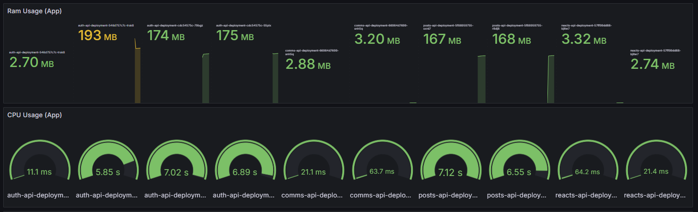
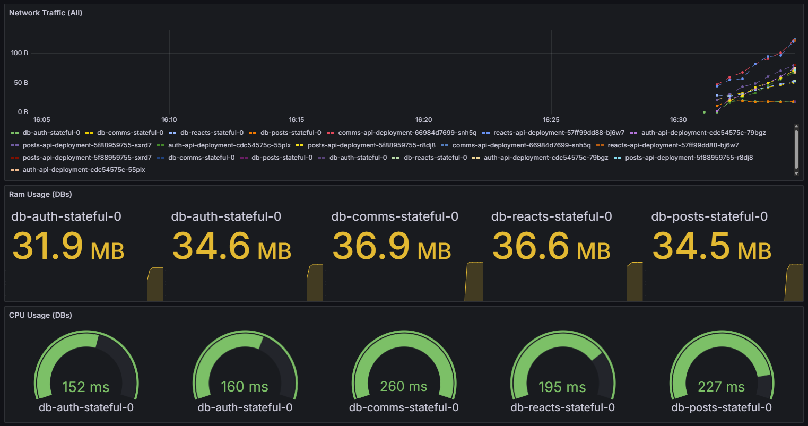

## Documentacion
La siguiente documentacion describe la forma de desplegar de manera automatica un cluster de kubernetes en Google Cloud Platform usando kubespray, y usando Jenkins, realizar CI/CD

### Instalar Elastic Search 

Instalamos Elastic Stack empezando por elastic search, usando el siguiente archivo de configuracion:
```yaml
clusterName: "elasticsearch"
nodeGroup: "master"

# The service that non master groups will try to connect to when joining the cluster
# This should be set to clusterName + "-" + nodeGroup for your master group
masterService: ""

# Elasticsearch roles that will be applied to this nodeGroup
# These will be set as environment variables. E.g. node.roles=master
# https://www.elastic.co/guide/en/elasticsearch/reference/current/modules-node.html#node-roles
roles:
  - master
  - data
  - data_content
  - data_hot
  - data_warm
  - data_cold
  - ingest
  - ml
  - remote_cluster_client
  - transform

replicas: 1
minimumMasterNodes: 1

esMajorVersion: ""

# Allows you to add any config files in /usr/share/elasticsearch/config/
# such as elasticsearch.yml and log4j2.properties
esConfig: {}

createCert: true

esJvmOptions: {}

# Extra environment variables to append to this nodeGroup
# This will be appended to the current 'env:' key. You can use any of the kubernetes env
# syntax here
extraEnvs: []

# Allows you to load environment variables from kubernetes secret or config map
envFrom: []

# Disable it to use your own elastic-credential Secret.
secret:
  enabled: true
  password: "" # generated randomly if not defined

# A list of secrets and their paths to mount inside the pod
# This is useful for mounting certificates for security and for mounting
# the X-Pack license
secretMounts: []

hostAliases: []

image: "docker.elastic.co/elasticsearch/elasticsearch"
imageTag: "8.5.1"
imagePullPolicy: "IfNotPresent"

podAnnotations: {}

# additionals labels
labels: {}

esJavaOpts: "" # example: "-Xmx1g -Xms1g"

resources:
  requests:
    cpu: "1000m"
    memory: "2Gi"
  limits:
    cpu: "1000m"
    memory: "2Gi"

initResources: {}

networkHost: "0.0.0.0"

volumeClaimTemplate:
  accessModes: ["ReadWriteOnce"]
  resources:
    requests:
      storage: 30Gi

rbac:
  create: false
  serviceAccountAnnotations: {}
  serviceAccountName: ""
  automountToken: true

podSecurityPolicy:
  create: false
  name: ""
  spec:
    privileged: true
    fsGroup:
      rule: RunAsAny
    runAsUser:
      rule: RunAsAny
    seLinux:
      rule: RunAsAny
    supplementalGroups:
      rule: RunAsAny
    volumes:
      - secret
      - configMap
      - persistentVolumeClaim
      - emptyDir

persistence:
  enabled: true
  labels:
    # Add default labels for the volumeClaimTemplate of the StatefulSet
    enabled: false
  annotations: {}

extraVolumes: []
# - name: extras
#   emptyDir: {}

extraVolumeMounts: []
# - name: extras
#   mountPath: /usr/share/extras
#   readOnly: true

extraContainers: []
# - name: do-something
#   image: busybox
#   command: ['do', 'something']

extraInitContainers: []
# - name: do-something
#   image: busybox
#   command: ['do', 'something']

# This is the PriorityClass settings as defined in
# https://kubernetes.io/docs/concepts/configuration/pod-priority-preemption/#priorityclass
priorityClassName: ""

# By default this will make sure two pods don't end up on the same node
# Changing this to a region would allow you to spread pods across regions
antiAffinityTopologyKey: "kubernetes.io/hostname"

# Hard means that by default pods will only be scheduled if there are enough nodes for them
# and that they will never end up on the same node. Setting this to soft will do this "best effort"
antiAffinity: "hard"

# This is the node affinity settings as defined in
# https://kubernetes.io/docs/concepts/configuration/assign-pod-node/#node-affinity-beta-feature
nodeAffinity: {}

# The default is to deploy all pods serially. By setting this to parallel all pods are started at
# the same time when bootstrapping the cluster
podManagementPolicy: "Parallel"

# The environment variables injected by service links are not used, but can lead to slow Elasticsearch boot times when
# there are many services in the current namespace.
# If you experience slow pod startups you probably want to set this to `false`.
enableServiceLinks: true

protocol: https
httpPort: 9200
transportPort: 9300

service:
  enabled: true
  labels: {}
  labelsHeadless: {}
  type: ClusterIP
  # Consider that all endpoints are considered "ready" even if the Pods themselves are not
  # https://kubernetes.io/docs/reference/kubernetes-api/service-resources/service-v1/#ServiceSpec
  publishNotReadyAddresses: false
  nodePort: ""
  annotations: {}
  httpPortName: http
  transportPortName: transport
  loadBalancerIP: ""
  loadBalancerSourceRanges: []
  externalTrafficPolicy: ""

updateStrategy: RollingUpdate

# This is the max unavailable setting for the pod disruption budget
# The default value of 1 will make sure that kubernetes won't allow more than 1
# of your pods to be unavailable during maintenance
maxUnavailable: 1

podSecurityContext:
  fsGroup: 1000
  runAsUser: 1000

securityContext:
  capabilities:
    drop:
      - ALL
  # readOnlyRootFilesystem: true
  runAsNonRoot: true
  runAsUser: 1000

# How long to wait for elasticsearch to stop gracefully
terminationGracePeriod: 120

sysctlVmMaxMapCount: 262144

readinessProbe:
  failureThreshold: 3
  initialDelaySeconds: 10
  periodSeconds: 10
  successThreshold: 3
  timeoutSeconds: 5

clusterHealthCheckParams: "wait_for_status=green&timeout=1s"

schedulerName: ""

imagePullSecrets: []
nodeSelector: {}
tolerations: []

# Enabling this will publicly expose your Elasticsearch instance.
ingress:
  enabled: false
  annotations: {}
  className: "nginx"
  pathtype: ImplementationSpecific
  hosts:
    - host: chart-example.local
      paths:
        - path: /
  tls: []

nameOverride: ""
fullnameOverride: ""
healthNameOverride: ""

lifecycle: {}

sysctlInitContainer:
  enabled: true

keystore: []

networkPolicy:

  http:
    enabled: false
  transport:
    enabled: false
tests:
  enabled: true


```

Usamos Helm para aplicar la configuracion
```bash
helm install elasticsearch -n elastic-stack --create-namespace elastic/elasticsearch -f elasticsearch/values.yaml
```

### Instalar Filebeat
El siguiente debe ser filebeat, este se encarga de recopilar los logs de todos los nodos y enviarlos a logstash

```yaml
daemonset:
  # Annotations to apply to the daemonset
  annotations: {}
  # additionals labels
  labels: {}
  affinity: {}
  # Include the daemonset
  enabled: true
  # Extra environment variables for Filebeat container.
  envFrom: []
  # - configMapRef:
  #     name: config-secret
  extraEnvs:
    - name: "ELASTICSEARCH_USERNAME"
      valueFrom:
        secretKeyRef:
          name: elasticsearch-master-credentials
          key: username
    - name: "ELASTICSEARCH_PASSWORD"
      valueFrom:
        secretKeyRef:
          name: elasticsearch-master-credentials
          key: password
  # Allows you to add any config files in /usr/share/filebeat
  extraVolumes: []
  # - name: extras
  #   emptyDir: {}
  extraVolumeMounts: []
  # - name: extras
  #   mountPath: /usr/share/extras
  #   readOnly: true
  hostNetworking: false
  # Allows you to add any config files in /usr/share/filebeat
  # such as filebeat.yml for daemonset
  filebeatConfig:
    filebeat.yml: |
      filebeat.inputs:
      - type: container
        paths:
          - /var/log/containers/*.log
        processors:
        - add_kubernetes_metadata:
            host: ${NODE_NAME}
            matchers:
            - logs_path:
                logs_path: "/var/log/containers/"

      output.logstash:
        hosts: ["logstash-logstash:5044"]
  #     ssl.certificate_authorities: ["/usr/share/filebeat/certs/ca.crt"]
  #     ssl.certificate: "/usr/share/filebeat/certs/tls.crt"
  #     ssl.key: "/usr/share/filebeat/certs/tls.key"
  # Only used when updateStrategy is set to "RollingUpdate"
  maxUnavailable: 1
  nodeSelector: {}
  # A list of secrets and their paths to mount inside the pod
  # This is useful for mounting certificates for security other sensitive values
  secretMounts:
    - name: elasticsearch-master-certs
      secretName: elasticsearch-master-certs
      path: /usr/share/filebeat/certs/
      
  securityContext:
    runAsUser: 0
    privileged: false
  resources:
    requests:
      cpu: "100m"
      memory: "100Mi"
    limits:
      cpu: "1000m"
      memory: "200Mi"
  tolerations: []

deployment:
  annotations: {}
  labels: {}
  affinity: {}
  enabled: false
  envFrom: []
  extraEnvs:
    - name: "ELASTICSEARCH_USERNAME"
      valueFrom:
        secretKeyRef:
          name: elasticsearch-master-credentials
          key: username
    - name: "ELASTICSEARCH_PASSWORD"
      valueFrom:
        secretKeyRef:
          name: elasticsearch-master-credentials
          key: password
  extraVolumes: []
  extraVolumeMounts: []
  filebeatConfig:
    filebeat.yml: |
      filebeat.inputs:
        - type: log
          paths:
            - /usr/share/filebeat/logs/filebeat

      output.elasticsearch:
        host: "${NODE_NAME}"
        hosts: '["https://${ELASTICSEARCH_HOSTS:elasticsearch-master:9200}"]'
        username: "${ELASTICSEARCH_USERNAME}"
        password: "${ELASTICSEARCH_PASSWORD}"
        protocol: https
        ssl.certificate_authorities: ["/usr/share/filebeat/certs/ca.crt"]
  nodeSelector: {}
  secretMounts:
    - name: elasticsearch-master-certs
      secretName: elasticsearch-master-certs
      path: /usr/share/filebeat/certs/

  securityContext:
    runAsUser: 0
    privileged: false
  resources:
    requests:
      cpu: "100m"
      memory: "100Mi"
    limits:
      cpu: "1000m"
      memory: "200Mi"
  tolerations: []

replicas: 1

extraContainers: ""

extraInitContainers: []
hostPathRoot: /var/lib

dnsConfig: {}
hostAliases: []
image: "docker.elastic.co/beats/filebeat"
imageTag: "8.5.1"
imagePullPolicy: "IfNotPresent"
imagePullSecrets: []

livenessProbe:
  exec:
    command:
      - sh
      - -c
      - |
        #!/usr/bin/env bash -e
        curl --fail 127.0.0.1:5066
  failureThreshold: 3
  initialDelaySeconds: 10
  periodSeconds: 10
  timeoutSeconds: 5

readinessProbe:
  exec:
    command:
      - sh
      - -c
      - |
        #!/usr/bin/env bash -e
        filebeat test output
  failureThreshold: 3
  initialDelaySeconds: 10
  periodSeconds: 10
  timeoutSeconds: 5
  
managedServiceAccount: true

clusterRoleRules:
  - apiGroups:
      - ""
    resources:
      - namespaces
      - nodes
      - pods
    verbs:
      - get
      - list
      - watch
  - apiGroups:
      - "apps"
    resources:
      - replicasets
    verbs:
      - get
      - list
      - watch

podAnnotations: {}

serviceAccount: ""

serviceAccountAnnotations: {}

terminationGracePeriod: 30
priorityClassName: ""

updateStrategy: RollingUpdate

nameOverride: ""
fullnameOverride: ""
```

```bash
helm install filebeat -n elastic-stack elastic/filebeat -f filebeat/values.yaml
```

### Instalar LogStash

```yaml
replicas: 1

logstashConfig: {}

# Allows you to add any pipeline files in /usr/share/logstash/pipeline/
### ***warn*** there is a hardcoded logstash.conf in the image, override it first
logstashPipeline:
 logstash.conf: |
   input {
     beats {
       port => 5044
     }
   }
   output {
      elasticsearch {
        hosts => "https://elasticsearch-master:9200"
        cacert => "/usr/share/logstash/config/elasticsearch-master-certs/ca.crt"
        user => "${ELASTICSEARCH_USERNAME}"
        password => "${ELASTICSEARCH_PASSWORD}"
      }
   }

# Allows you to add any pattern files in your custom pattern dir
logstashPatternDir: "/usr/share/logstash/patterns/"
logstashPattern: {}

extraEnvs: 
  - name: "ELASTICSEARCH_USERNAME"
    valueFrom:
      secretKeyRef:
        name: elasticsearch-master-credentials
        key: username
  - name: "ELASTICSEARCH_PASSWORD"
    valueFrom:
      secretKeyRef:
        name: elasticsearch-master-credentials
        key: password

# Allows you to load environment variables from kubernetes secret or config map
envFrom: []

# Add sensitive data to k8s secrets
secrets: []

# A list of secrets and their paths to mount inside the pod
secretMounts:
  - name: "elasticsearch-master-certs"
    secretName: "elasticsearch-master-certs"
    path: "/usr/share/logstash/config/elasticsearch-master-certs/"

hostAliases: []

image: "docker.elastic.co/logstash/logstash"
imageTag: "8.5.1"
imagePullPolicy: "IfNotPresent"
imagePullSecrets: []

podAnnotations: {}

# additionals labels
labels: {}

logstashJavaOpts: "-Xmx1g -Xms1g"

resources:
  requests:
    cpu: "100m"
    memory: "1536Mi"
  limits:
    cpu: "1000m"
    memory: "1536Mi"

volumeClaimTemplate:
  accessModes: ["ReadWriteOnce"]
  resources:
    requests:
      storage: 1Gi

rbac:
  create: false
  serviceAccountAnnotations: {}
  serviceAccountName: ""
  annotations:
    {}

podSecurityPolicy:
  create: false
  name: ""
  spec:
    privileged: false
    fsGroup:
      rule: RunAsAny
    runAsUser:
      rule: RunAsAny
    seLinux:
      rule: RunAsAny
    supplementalGroups:
      rule: RunAsAny
    volumes:
      - secret
      - configMap
      - persistentVolumeClaim

persistence:
  enabled: false
  annotations: {}

extraVolumes:
  []

extraVolumeMounts:
  []

extraContainers:
  []

extraInitContainers:
  []
  
priorityClassName: ""

antiAffinityTopologyKey: "kubernetes.io/hostname"

antiAffinity: "hard"

nodeAffinity: {}

podAffinity: {}

podManagementPolicy: "Parallel"

httpPort: 9600

extraPorts:
  []

updateStrategy: RollingUpdate

maxUnavailable: 1

podSecurityContext:
  fsGroup: 1000
  runAsUser: 1000

securityContext:
  capabilities:
    drop:
      - ALL
  # readOnlyRootFilesystem: true
  runAsNonRoot: true
  runAsUser: 1000
  
terminationGracePeriod: 120

livenessProbe:
  httpGet:
    path: /
    port: http
  initialDelaySeconds: 300
  periodSeconds: 10
  timeoutSeconds: 5
  failureThreshold: 3
  successThreshold: 1

readinessProbe:
  httpGet:
    path: /
    port: http
  initialDelaySeconds: 60
  periodSeconds: 10
  timeoutSeconds: 5
  failureThreshold: 3
  successThreshold: 3
  
schedulerName: ""

nodeSelector: {}
tolerations: []

nameOverride: ""
fullnameOverride: ""

lifecycle:
  {}

service:
  annotations: {}
  type: ClusterIP
  loadBalancerIP: ""
  ports:
    - name: beats
      port: 5044
      protocol: TCP
      targetPort: 5044
    - name: http
      port: 8080
      protocol: TCP
      targetPort: 8080

ingress:
  enabled: false
  annotations:
    {}
  className: "nginx"
  pathtype: ImplementationSpecific
  hosts:
    - host: logstash-example.local
      paths:
        - path: /beats
          servicePort: 5044
        - path: /http
          servicePort: 8080
  tls: []
```

```bash
helm install logstash -n elastic-stack elastic/logstash -f logstash/values.yaml
```

### Acceder al Dashboard de Kibana
```bash
kubectl port-forward -n monitoring service/kibana-kibana 5601:5601
```
#### Obtener Credenciales
- ```username: elastic```
- password:
```sh
kubectl get secret elasticsearch-master-credentials -n elastic-stack -o jsonpath={".data.password"} | base64 --decode
```

### Instalar Kibana
```yaml
elasticsearchHosts: "https://elasticsearch-master:9200"
elasticsearchCertificateSecret: elasticsearch-master-certs
elasticsearchCertificateAuthoritiesFile: ca.crt
elasticsearchCredentialSecret: elasticsearch-master-credentials

replicas: 1

extraEnvs:
  - name: "NODE_OPTIONS"
    value: "--max-old-space-size=1800"
    
envFrom: []
secretMounts: []

hostAliases: []

image: "docker.elastic.co/kibana/kibana"
imageTag: "8.5.1"
imagePullPolicy: "IfNotPresent"

# additionals labels
labels: {}
annotations: {}
podAnnotations: {}

resources:
  requests:
    cpu: "1000m"
    memory: "2Gi"
  limits:
    cpu: "1000m"
    memory: "2Gi"

protocol: http
serverHost: "0.0.0.0"
healthCheckPath: "/app/kibana"
kibanaConfig: {}

podSecurityContext:
  fsGroup: 1000

securityContext:
  capabilities:
    drop:
      - ALL
  runAsNonRoot: true
  runAsUser: 1000

serviceAccount: ""

automountToken: true

priorityClassName: ""

httpPort: 5601

extraVolumes:
  []

extraVolumeMounts:
  []

extraContainers: []

extraInitContainers: []

updateStrategy:
  type: "Recreate"

service:
  type: ClusterIP
  loadBalancerIP: ""
  port: 5601
  nodePort: ""
  labels: {}
  annotations: {}
  loadBalancerSourceRanges: []
  httpPortName: http

ingress:
  enabled: false
  className: "nginx"
  pathtype: ImplementationSpecific
  annotations: {}
  hosts:
    - host: kibana-example.local
      paths:
        - path: /

readinessProbe:
  failureThreshold: 3
  initialDelaySeconds: 10
  periodSeconds: 10
  successThreshold: 3
  timeoutSeconds: 5

imagePullSecrets: []
nodeSelector: {}
tolerations: []
affinity: {}

nameOverride: ""
fullnameOverride: ""

lifecycle: {}
```

```bash
helm install kibana -n elastic-stack elastic/kibana -f kibana/values.yaml
```

### Instalar Prometheus y Grafana
Usando helm, instalamos el cluster de Prometheus y Grafana

```bash
helm install prometheus prometheus-community/kube-prometheus-stack
```

### Acceder al Dashboard de Kibana y Grafana

Grafana
```bash
kubectl port-forward -n monitoring service/prometheus-grafana 3000:80
```
#### Obtener Credenciales
- ```username: admin```
- password:
```sh
kubectl get secrets prometheus-grafana -n monitoring -o jsonpath="{.data.admin-password}" | base64 -d ; echo
```


### Dashboards (Grafana)

---


### Alertas (Grafana)

